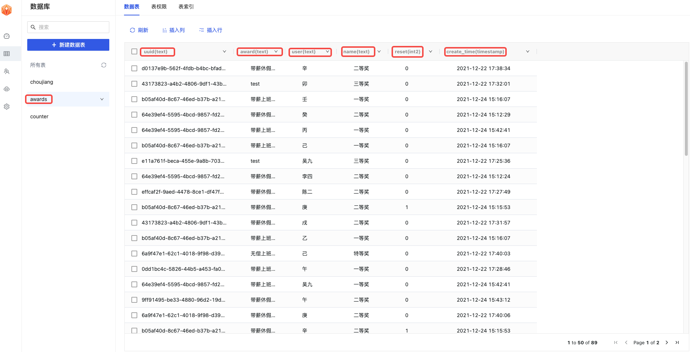

# lucky-ball
A simple lottery program.
一个简单的年会抽奖Web程序。[Demo](http://luckyball.surge.sh/index.html)

## Features
1. 可编辑奖项，包括奖项名称、中奖人数、奖品。
2. 如果单个奖项中奖人数过多，可分批抽取，每批人数可设置。
3. 可编辑参与人列表，也可从JS文件导入
4. 可按奖项顺序抽奖，也可选定某个奖项开始。
5. 如果中奖者没到场，可点击人名卡片删除，同时可再次抽取以作替补。
6. 可在任意奖项之间切换，可查中奖记录名单
7. 支持撤销当前轮次的抽奖结果，重新抽取。
8. 所有静态资源均在本地，可离线使用。下载整个仓库，用浏览器打开index.html即可。

## New
1. 新增数据库连接`MemFire Cloud`应用，参与人员可从数据库中导入；
2. 抽奖记录可全部存入数据库，新增uuid加以区分

## 使用
1. 登录[MemFire Cloud](https://cloud.memfiredb.com/)；
2. 新建应用；
3. 查看应用`anon`与网址，将其写入`js/mf.js`文件中的`url`与`secret`

4. 新建表格
* 新建一个`choujiang`表格记录抽奖参与人员

* 新建一个`awards`表格记录每次抽奖结果

5.开始抽奖吧！

Good luck to you guys!
